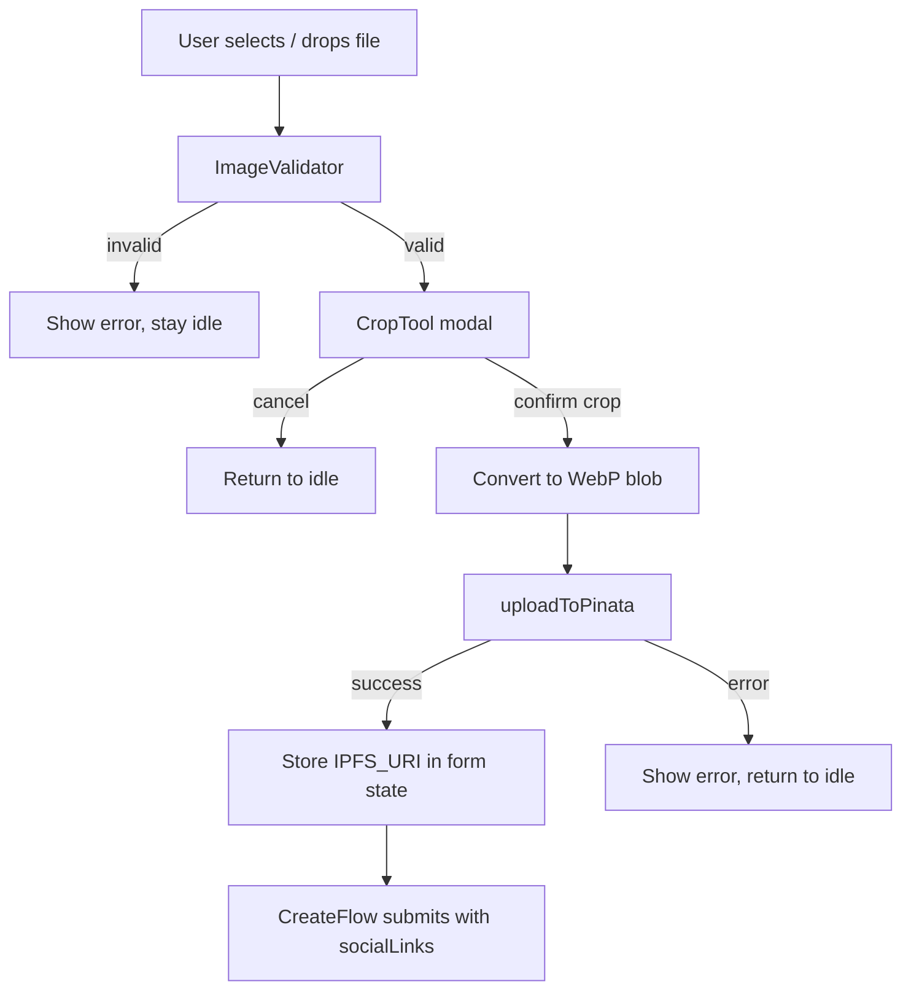

# Design Document: Campaign Image Upload

## Overview

This design enhances the existing campaign image upload experience in the Next.js frontend (`apps/interface/`). The current implementation in `create/page.tsx` Step2 has a basic file picker and Pinata upload but lacks drag-and-drop, in-browser cropping, robust fallback images, and thorough validation. This document describes the components, data flow, and correctness properties needed to implement the full feature.

## Architecture



The feature is composed of three new units plus modifications to two existing files:

| Unit | Type | Location |
|---|---|---|
| `ImageValidator` | Pure utility module | `src/lib/imageValidation.ts` |
| `ImageUploader` | React component | `src/components/ui/ImageUploader.tsx` |
| `CropTool` | React component (modal) | `src/components/ui/CropTool.tsx` |
| `CampaignCard` | Modified existing component | `src/components/ui/CampaignCard.tsx` |
| `create/page.tsx` Step2 | Modified existing page | `src/app/create/page.tsx` |

## Components and Interfaces

### ImageValidator (`src/lib/imageValidation.ts`)

```typescript
export type ValidationResult =
  | { ok: true }
  | { ok: false; error: string };

export const ACCEPTED_TYPES = ["image/png", "image/jpeg", "image/webp"] as const;
export const MAX_FILE_SIZE = 5 * 1024 * 1024; // 5 MB

export function validateImageFile(file: File): ValidationResult;
```

Rules (in priority order):
1. If `file.type` is not in `ACCEPTED_TYPES` → `{ ok: false, error: "Only PNG, JPG, or WebP images are allowed." }`
2. If `file.size > MAX_FILE_SIZE` → `{ ok: false, error: "Image must be under 5 MB." }`
3. Otherwise → `{ ok: true }`

### ImageUploader (`src/components/ui/ImageUploader.tsx`)

```typescript
export interface ImageUploaderProps {
  onUpload: (ipfsUri: string) => void;
  onClear: () => void;
  currentUri?: string;
}

export function ImageUploader(props: ImageUploaderProps): JSX.Element;
```

Internal state machine:

```
idle → dragging (dragenter)
dragging → idle (dragleave / drop-invalid)
idle / dragging → cropping (valid file selected or dropped)
cropping → idle (crop cancelled)
cropping → uploading (crop confirmed)
uploading → done (upload success)
uploading → idle (upload error)
done → idle (clear)
```

The component renders:
- A drop zone `<div>` with `onDragEnter`, `onDragLeave`, `onDragOver`, `onDrop` handlers
- A hidden `<input type="file">` triggered by clicking the drop zone
- The `CropTool` modal when state is `cropping`
- An uploading spinner when state is `uploading`
- The IPFS URI confirmation when state is `done`

### CropTool (`src/components/ui/CropTool.tsx`)

Uses `react-image-crop` (already a common dependency in Next.js projects; add if absent).

```typescript
export interface CropToolProps {
  imageSrc: string;           // object URL of the selected file
  onConfirm: (blob: Blob) => void;  // blob is always image/webp
  onCancel: () => void;
}

export function CropTool(props: CropToolProps): JSX.Element;
```

- Aspect ratio locked to `16 / 9`
- On confirm: draws the crop onto an offscreen `<canvas>`, calls `canvas.toBlob(cb, "image/webp", 0.9)`, passes the blob to `onConfirm`

### CampaignCard modifications

Add a `getFallbackImage(id: string): string` helper:

```typescript
// Deterministic: same id always returns same URL
export function getFallbackImage(id: string): string {
  // Uses a hash of the id to pick from a set of gradient placeholder URLs
  // e.g. https://picsum.photos/seed/<hash>/800/450
  const seed = id.split("").reduce((acc, c) => acc + c.charCodeAt(0), 0);
  return `https://picsum.photos/seed/${seed}/800/450`;
}
```

`CampaignCard` changes:
- Import `getFallbackImage`
- Resolve the image src: `const src = isValidImageUri(campaign.image) ? campaign.image : getFallbackImage(campaign.id)`
- Add `onError` handler on `<Image>` that sets local state to the fallback src

```typescript
export function isValidImageUri(uri?: string): boolean {
  if (!uri || uri.trim() === "") return false;
  return uri.startsWith("ipfs://") || uri.startsWith("http://") || uri.startsWith("https://");
}
```

## Data Models

### ImageUploaderState

```typescript
type ImageUploaderState =
  | { status: "idle" }
  | { status: "dragging" }
  | { status: "cropping"; objectUrl: string }
  | { status: "uploading" }
  | { status: "done"; ipfsUri: string }
  | { status: "error"; message: string };
```

### FormData (existing, no change needed)

The existing `imageUrl: string` field in `FormData` in `create/page.tsx` already holds the IPFS URI. No schema change required.

### Campaign type (existing)

The `image?: string` field already exists. No change needed to the type definition.

## Correctness Properties

*A property is a characteristic or behavior that should hold true across all valid executions of a system — essentially, a formal statement about what the system should do. Properties serve as the bridge between human-readable specifications and machine-verifiable correctness guarantees.*

---

**Property 1: Invalid MIME type is always rejected**
*For any* file whose MIME type is not `image/png`, `image/jpeg`, or `image/webp`, `validateImageFile` should return `{ ok: false }` with the type error message.
**Validates: Requirements 1.1**

---

**Property 2: Oversized file is always rejected**
*For any* file with a valid MIME type but size greater than 5 MB, `validateImageFile` should return `{ ok: false }` with the size error message.
**Validates: Requirements 1.2**

---

**Property 3: Valid file is always accepted**
*For any* file with a valid MIME type and size ≤ 5 MB, `validateImageFile` should return `{ ok: true }`.
**Validates: Requirements 1.3**

---

**Property 4: Drag highlight is toggled on enter and removed on leave**
*For any* `ImageUploader` in idle state, firing `dragenter` should produce the dragging highlight class, and subsequently firing `dragleave` should remove it — restoring the original visual state.
**Validates: Requirements 2.1, 2.2**

---

**Property 5: Drop and file-picker produce equivalent behaviour**
*For any* valid image file, dropping it on the drop zone and selecting it via the file picker should both invoke the same validation path and transition the component to the `cropping` state.
**Validates: Requirements 2.3**

---

**Property 6: Controls are disabled during upload**
*For any* `ImageUploader` in the `uploading` state, the drop zone and file input should both be disabled (non-interactive).
**Validates: Requirements 2.5, 4.5**

---

**Property 7: Crop is shown before upload; upload is not triggered until confirm**
*For any* valid file selection, the component should enter the `cropping` state and `uploadToPinata` should not have been called until the user explicitly confirms the crop.
**Validates: Requirements 3.1, 3.2, 4.1**

---

**Property 8: Cancelling crop returns to idle without uploading**
*For any* `ImageUploader` in the `cropping` state, invoking cancel should transition the component to `idle` and `uploadToPinata` should never have been called.
**Validates: Requirements 3.3**

---

**Property 9: Cropped output is always a WebP blob**
*For any* image file (PNG, JPEG, or WebP), the blob produced by `CropTool.onConfirm` should have `type === "image/webp"`.
**Validates: Requirements 3.5**

---

**Property 10: Successful upload stores URI and displays it**
*For any* IPFS URI returned by a mocked `uploadToPinata`, the `onUpload` callback should be called with that exact URI and the URI should appear in the rendered output.
**Validates: Requirements 4.2, 4.3**

---

**Property 11: Failed upload shows error and returns to idle**
*For any* error thrown by a mocked `uploadToPinata`, the component should display the error message and transition back to `idle` state.
**Validates: Requirements 4.4**

---

**Property 12: socialLinks mapping from imageUrl**
*For any* form submission, if `imageUrl` is non-empty the `socialLinks` argument to `buildInitializeTx` should equal `[imageUrl]`; if `imageUrl` is empty, `socialLinks` should be `undefined`.
**Validates: Requirements 5.1, 5.2**

---

**Property 13: Image vs fallback rendering based on URI validity**
*For any* `Campaign`, if `campaign.image` is a valid URI the rendered `<Image>` src should equal that URI; if `campaign.image` is undefined, empty, or invalid, the rendered src should equal `getFallbackImage(campaign.id)`.
**Validates: Requirements 6.1, 6.3**

---

**Property 14: Fallback is deterministic for a given campaign id**
*For any* campaign id string, calling `getFallbackImage` twice with the same id should return the same URL.
**Validates: Requirements 6.2**

---

**Property 15: onError triggers fallback**
*For any* `CampaignCard` rendered with a valid image URI, simulating an `onError` event on the image element should cause the rendered src to switch to `getFallbackImage(campaign.id)`.
**Validates: Requirements 6.4**

## Error Handling

| Scenario | Handling |
|---|---|
| Invalid file type | `ImageValidator` returns error; displayed inline; no upload attempted |
| File too large | `ImageValidator` returns error; displayed inline; no upload attempted |
| Pinata API keys missing | `uploadToPinata` throws; `ImageUploader` catches, displays message, returns to idle |
| Pinata upload HTTP error | `uploadToPinata` throws; same as above |
| Image load failure in `CampaignCard` | `onError` handler swaps src to fallback |
| Crop canvas `toBlob` returns null | `ImageUploader` displays "Failed to process image." and returns to idle |

## Testing Strategy

**Dual testing approach**: unit tests for specific examples and edge cases; property-based tests for universal properties.

**Property-based testing library**: `fast-check` (add to devDependencies if not present).

**Unit tests** cover:
- Specific valid/invalid file examples for `validateImageFile`
- The edge case where both type and size are invalid (type error returned first)
- The 16:9 aspect ratio configuration in `CropTool`
- The `getFallbackImage` and `isValidImageUri` helpers with concrete inputs

**Property tests** cover Properties 1–15 above. Each test runs a minimum of 100 iterations.

Tag format for each property test:
`// Feature: campaign-image-upload, Property <N>: <property title>`

Property tests are placed in:
- `src/lib/imageValidation.test.ts` — Properties 1, 2, 3
- `src/components/ui/ImageUploader.test.tsx` — Properties 4, 5, 6, 7, 8, 9, 10, 11
- `src/app/create/page.test.tsx` — Property 12
- `src/components/ui/CampaignCard.test.tsx` — Properties 13, 14, 15
