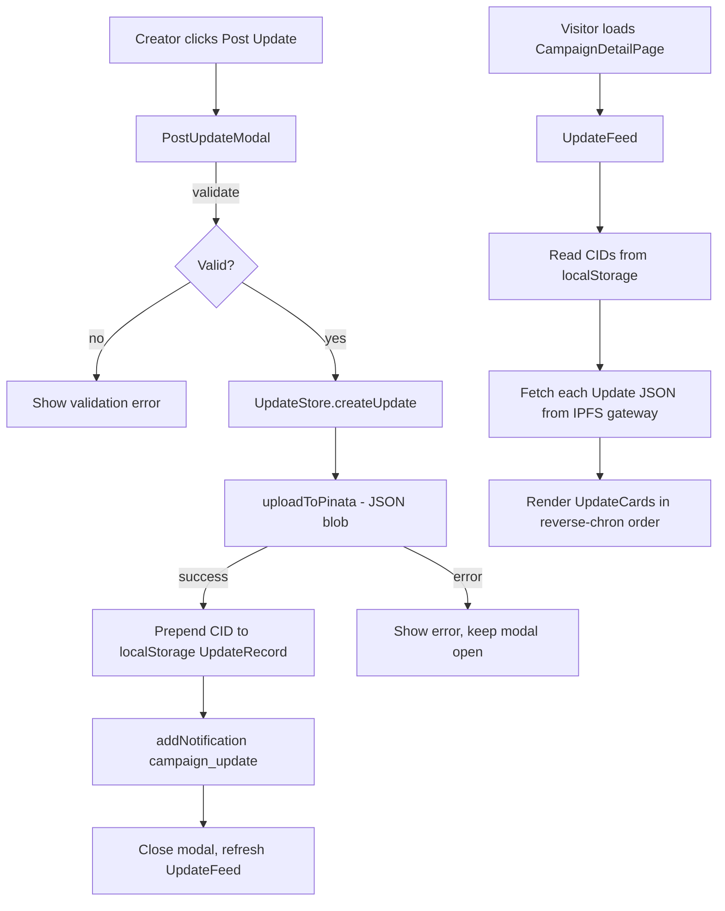

# Design Document: Campaign Updates

## Overview

This feature adds creator-authored campaign updates to the Next.js frontend. Updates are JSON objects uploaded to IPFS via the existing Pinata integration. A lightweight index of IPFS CIDs per campaign is persisted in `localStorage`. The Dashboard gains a "Post Update" button per active campaign card; the campaign detail page gains an `UpdateFeed` component. The existing `NotificationContext` is extended with a `"campaign_update"` type.

## Architecture



| Unit | Type | Location |
|---|---|---|
| `UpdateStore` | Utility module | `src/lib/updateStore.ts` |
| `PostUpdateModal` | React component | `src/components/ui/PostUpdateModal.tsx` |
| `UpdateFeed` | React component | `src/components/ui/UpdateFeed.tsx` |
| `UpdateCard` | React component (sub) | `src/components/ui/UpdateFeed.tsx` |
| `DashboardCampaignCard` | Modified existing | `src/app/dashboard/page.tsx` |
| `CampaignDetailPage` | Modified existing | `src/app/campaigns/[id]/page.tsx` |
| `NotificationContext` | Modified existing | `src/context/NotificationContext.tsx` |
| `NotificationDropdown` | Modified existing | `src/components/ui/NotificationDropdown.tsx` |

## Components and Interfaces

### UpdateStore (`src/lib/updateStore.ts`)

```typescript
export interface Update {
  campaignId: string;
  title: string;
  body: string;
  imageUri?: string;
  authorAddress: string;
  createdAt: number;       // Unix ms
  editedAt?: number;       // Unix ms, present only after an edit
}

// localStorage key pattern: "fmc:updates:<campaignId>"
const STORAGE_KEY = (id: string) => `fmc:updates:${id}`;

export function getCids(campaignId: string): string[];
export async function createUpdate(update: Update): Promise<string>; // returns CID
export async function fetchUpdate(cid: string): Promise<Update>;
export async function editUpdate(campaignId: string, oldCid: string, patch: Pick<Update, "title" | "body">): Promise<string>; // returns new CID
export function deleteUpdate(campaignId: string, cid: string): void;
```

`createUpdate` flow:
1. Serialise `Update` to JSON, wrap in a `File` blob (`application/json`)
2. Call `uploadToPinata(file)` → `ipfs://<CID>`
3. Extract CID, prepend to `getCids(campaignId)`, persist to `localStorage`
4. Return the CID

`fetchUpdate` flow:
1. Convert `ipfs://<CID>` to an HTTP gateway URL (e.g. `https://gateway.pinata.cloud/ipfs/<CID>`)
2. `fetch` the URL, parse JSON, return as `Update`

`editUpdate` flow:
1. Fetch the existing update via `fetchUpdate`
2. Merge `patch` fields, set `editedAt = Date.now()`, preserve `createdAt`
3. Upload new JSON via `uploadToPinata`, get new CID
4. Replace `oldCid` with new CID in `localStorage` array
5. Return new CID

`deleteUpdate`:
1. Remove `cid` from the `localStorage` array for `campaignId`

### PostUpdateModal (`src/components/ui/PostUpdateModal.tsx`)

```typescript
export interface PostUpdateModalProps {
  campaignId: string;
  campaignTitle: string;
  authorAddress: string;
  /** Present when editing an existing update */
  existingCid?: string;
  existingUpdate?: Pick<Update, "title" | "body">;
  onClose: () => void;
  onSuccess: (cid: string) => void;
}

export function PostUpdateModal(props: PostUpdateModalProps): JSX.Element;
```

Internal state: `idle | submitting | error`

Validation rules:
- `title`: non-empty after trim, max 100 chars
- `body`: non-empty after trim, max 2000 chars

### UpdateFeed (`src/components/ui/UpdateFeed.tsx`)

```typescript
export interface UpdateFeedProps {
  campaignId: string;
  /** Connected wallet address — enables edit/delete controls when it matches authorAddress */
  connectedAddress?: string;
}

export function UpdateFeed(props: UpdateFeedProps): JSX.Element;
```

Fetching strategy:
- On mount, read CIDs from `UpdateStore.getCids(campaignId)`
- Fetch all updates in parallel via `Promise.allSettled`
- Render fulfilled results as `UpdateCard`; render error placeholder for rejected ones
- Re-fetch when a new CID is added (via a `refreshKey` prop or internal state increment)

### NotificationContext extension

Add `"campaign_update"` to `NotificationType`:

```typescript
export type NotificationType =
  | "contribution"
  | "goal_reached"
  | "deadline"
  | "campaign_update"
  | "info";
```

`UpdateStore.createUpdate` accepts an optional `addNotification` callback and calls it after a successful upload:

```typescript
addNotification({
  type: "campaign_update",
  title: campaignTitle,
  message: `New update: ${update.title}`,
  campaignId: update.campaignId,
});
```

### NotificationDropdown extension

Add a `Megaphone` (or `Newspaper`) icon case for `"campaign_update"` in `typeIcon()`. Add `onClick` navigation to `/campaigns/<campaignId>` when the notification has a `campaignId`.

## Data Models

### Update (IPFS JSON payload)

```typescript
{
  campaignId: string;
  title: string;          // max 100 chars
  body: string;           // max 2000 chars
  imageUri?: string;      // ipfs:// URI, optional
  authorAddress: string;  // Stellar public key
  createdAt: number;      // Unix ms
  editedAt?: number;      // Unix ms, only after edit
}
```

### UpdateRecord (localStorage)

```
Key:   "fmc:updates:<campaignId>"
Value: JSON array of CID strings, most-recent first
       e.g. ["Qm...", "Qm...", "Qm..."]
```

## Correctness Properties

*A property is a characteristic or behavior that should hold true across all valid executions of a system — essentially, a formal statement about what the system should do. Properties serve as the bridge between human-readable specifications and machine-verifiable correctness guarantees.*

---

**Property 1: Update round-trip serialisation**
*For any* valid `Update` object, serialising it to JSON and deserialising it back should produce an equivalent object.
**Validates: Requirements 1.2, 1.3**

---

**Property 2: CID prepend ordering**
*For any* campaign ID and sequence of `createUpdate` calls, `getCids` should return CIDs in reverse insertion order (most-recent first).
**Validates: Requirements 1.4, 1.5**

---

**Property 3: Delete removes exactly one CID**
*For any* campaign with N CIDs, calling `deleteUpdate` with one of those CIDs should result in exactly N-1 CIDs, with all other CIDs unchanged.
**Validates: Requirements 1.6, 7.3**

---

**Property 4: localStorage corruption returns empty array**
*For any* corrupted or missing `localStorage` entry, `getCids` should return an empty array without throwing.
**Validates: Requirements 1.7**

---

**Property 5: Whitespace-only title and body are invalid**
*For any* `PostUpdateModal` submission where `title` or `body` is composed entirely of whitespace, the modal should reject the submission and not call `UpdateStore.createUpdate`.
**Validates: Requirements 3.2**

---

**Property 6: Controls disabled during upload**
*For any* `PostUpdateModal` in the `submitting` state, all form controls and the submit button should be disabled.
**Validates: Requirements 3.4**

---

**Property 7: UpdateFeed renders updates in reverse-chronological order**
*For any* list of `Update` objects with distinct `createdAt` values, `UpdateFeed` should render them with the most-recent `createdAt` appearing first in the DOM.
**Validates: Requirements 4.2**

---

**Property 8: Edit preserves createdAt and sets editedAt**
*For any* existing update, calling `editUpdate` should produce a new `Update` where `createdAt` equals the original and `editedAt` is greater than `createdAt`.
**Validates: Requirements 6.4**

---

**Property 9: Edit replaces old CID with new CID**
*For any* campaign's CID list, after `editUpdate(campaignId, oldCid, patch)`, the list should contain the new CID and should not contain `oldCid`.
**Validates: Requirements 6.3**

---

**Property 10: Notification fired on successful create**
*For any* successful `createUpdate` call with an `addNotification` callback, the callback should be called exactly once with `type: "campaign_update"` and the correct `campaignId`.
**Validates: Requirements 5.1**

## Error Handling

| Scenario | Handling |
|---|---|
| Pinata upload fails | `createUpdate` / `editUpdate` throws; `PostUpdateModal` catches, displays error, stays open |
| IPFS fetch fails for one update | `UpdateFeed` renders error placeholder for that card; other cards unaffected |
| `localStorage` unavailable | `getCids` returns `[]`; writes are silently swallowed |
| Empty title or body | `PostUpdateModal` shows inline validation error; no upload attempted |
| Deletion fails (unexpected) | `UpdateCard` shows error message; CID remains in list |

## Testing Strategy

**Dual testing approach**: unit tests for specific examples and edge cases; property-based tests for universal properties using `fast-check`.

**Unit tests** cover:
- `getCids` with a missing key, a valid key, and a corrupted JSON value
- `PostUpdateModal` renders with correct initial state for create vs. edit modes
- `UpdateCard` shows "Edited" label when `editedAt` is present
- `NotificationDropdown` renders the `Megaphone` icon for `"campaign_update"` type

**Property tests** cover Properties 1–10 above. Each test runs a minimum of 100 iterations.

Tag format: `// Feature: campaign-updates, Property <N>: <property title>`

Property tests are placed in:
- `src/lib/updateStore.test.ts` — Properties 1, 2, 3, 4, 8, 9, 10
- `src/components/ui/PostUpdateModal.test.tsx` — Properties 5, 6
- `src/components/ui/UpdateFeed.test.tsx` — Property 7
