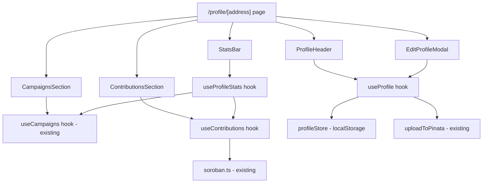

# Design Document: User Profile Pages

## Overview

User Profile Pages add a public `/profile/[address]` route to the Fund-My-Cause frontend. Each page shows the profile owner's avatar, bio, social links, campaigns they created, their contribution history, and aggregate stats. Profile customization data (avatar, bio, social links) is stored in `localStorage` under `fmc:profile:[address]` and optionally pinned to IPFS via Pinata. Campaign data is read from the existing `fmc:campaigns` localStorage registry. Contribution history is derived from on-chain data via the existing Soroban RPC layer.

---

## Architecture



The page is a **client component** (`"use client"`) because it reads from `localStorage` and uses `useWallet`. It lives at `apps/interface/src/app/profile/[address]/page.tsx`.

---

## Components and Interfaces

### Page: `app/profile/[address]/page.tsx`

```typescript
// Client component — reads localStorage, uses wallet context
export default function ProfilePage({ params }: { params: { address: string } })
```

Renders `<Navbar />` + four sections: `ProfileHeader`, `StatsBar`, `CampaignsSection`, `ContributionsSection`. Conditionally renders `EditProfileModal` when the connected user owns the profile.

---

### Component: `ProfileHeader`

Displays avatar (or identicon fallback), truncated wallet address with copy button, bio, and social links. Shows "Edit Profile" button when `isOwner` is true.

```typescript
interface ProfileHeaderProps {
  address: string;
  profile: ProfileData;
  isOwner: boolean;
  onEdit: () => void;
}
```

---

### Component: `StatsBar`

Four stat tiles: campaigns created, total raised (XLM), contributions made, total contributed (XLM).

```typescript
interface StatsBarProps {
  campaignCount: number;
  totalRaised: number;
  contributionCount: number;
  totalContributed: number;
  loading: boolean;
}
```

---

### Component: `CampaignsSection`

Reads contract IDs from `fmc:campaigns` registry for the given address, renders a `DashboardCampaignCard` (read-only variant) per campaign. Shows loading skeleton and empty state.

---

### Component: `ContributionsSection`

Fetches and lists contribution history. Each row shows campaign title, amount in XLM, and date. Shows loading skeleton, empty state, and retry button on error.

---

### Component: `EditProfileModal`

Modal form with:
- Avatar file input (uploads to Pinata on submit)
- Bio textarea (max 300 chars, live counter)
- Social links list (up to 5 URLs, add/remove)

```typescript
interface EditProfileModalProps {
  address: string;
  current: ProfileData;
  onSave: (updated: ProfileData) => void;
  onClose: () => void;
}
```

---

### Hook: `useProfile(address: string)`

Reads/writes `ProfileData` from `profileStore`. Returns `{ profile, saveProfile, loading }`.

---

### Hook: `useContributions(address: string)`

Fetches contribution history for an address from the Soroban RPC. Returns `{ contributions, loading, error, retry }`.

```typescript
interface ContributionEntry {
  contractId: string;
  campaignTitle: string;
  amount: number; // XLM
  date: string;   // ISO string
}
```

---

### Hook: `useProfileStats(address: string)`

Derives aggregate stats from campaign data and contribution history.

---

## Data Models

### `ProfileData`

```typescript
interface ProfileData {
  avatarUri: string;   // IPFS URI or empty string
  bio: string;         // max 300 chars
  socialLinks: string[]; // max 5 valid URLs
}

const DEFAULT_PROFILE: ProfileData = {
  avatarUri: "",
  bio: "",
  socialLinks: [],
};
```

### `profileStore` (localStorage)

```typescript
// Key: `fmc:profile:${address}`
// Value: JSON-serialized ProfileData

function readProfile(address: string): ProfileData
function writeProfile(address: string, data: ProfileData): void
```

- `readProfile` validates the parsed object against the `ProfileData` schema.
- If validation fails, it removes the invalid entry and returns `DEFAULT_PROFILE`.
- `writeProfile` serializes to JSON and writes to `localStorage`.

### `ContributionEntry`

```typescript
interface ContributionEntry {
  contractId: string;
  campaignTitle: string;
  amount: number;
  date: string;
}
```

---

## Correctness Properties

*A property is a characteristic or behavior that should hold true across all valid executions of a system — essentially, a formal statement about what the system should do. Properties serve as the bridge between human-readable specifications and machine-verifiable correctness guarantees.*

---

Property 1: Profile round-trip consistency
*For any* valid `ProfileData` object, writing it to the store and then reading it back should produce an equivalent object.
**Validates: Requirements 7.4, 7.5**

---

Property 2: Invalid profile data returns default
*For any* string that is not valid `ProfileData` JSON stored under a profile key, `readProfile` should return `DEFAULT_PROFILE` and remove the invalid entry from localStorage.
**Validates: Requirements 7.2, 7.3**

---

Property 3: Bio length validation
*For any* bio string with length > 300, the edit form should reject submission and the stored profile should remain unchanged.
**Validates: Requirements 5.4**

---

Property 4: Social links count validation
*For any* social links array with length > 5, the edit form should reject submission and the stored profile should remain unchanged.
**Validates: Requirements 5.5**

---

Property 5: Social link URL validity
*For any* set of social links stored in a profile, every link rendered as an anchor must be a well-formed URL (parseable by `new URL()`).
**Validates: Requirements 6.5**

---

Property 6: Stats totals are non-negative
*For any* set of campaigns and contributions, the computed `totalRaised` and `totalContributed` values must be ≥ 0.
**Validates: Requirements 4.1, 4.2**

---

Property 7: Stats counts match data length
*For any* list of campaigns and contributions, `campaignCount` must equal the number of campaigns and `contributionCount` must equal the number of contribution entries.
**Validates: Requirements 4.3, 4.4**

---

## Error Handling

| Scenario | Behavior |
|---|---|
| `localStorage` unavailable | `readProfile` returns `DEFAULT_PROFILE`; `writeProfile` silently no-ops |
| Pinata upload fails | `EditProfileModal` shows error toast; previous `avatarUri` is retained |
| Contribution fetch fails | `ContributionsSection` shows error message with retry button |
| Invalid stored profile JSON | `readProfile` removes entry, returns `DEFAULT_PROFILE` |
| Address has no campaigns | `CampaignsSection` shows empty state |
| Address has no contributions | `ContributionsSection` shows empty state |

---

## Testing Strategy

### Unit Tests

- `profileStore.readProfile` with valid, invalid, and missing data
- `profileStore.writeProfile` serialization
- Bio and social links validation functions
- `useProfileStats` stat computation with various campaign/contribution arrays
- Social link URL validation helper

### Property-Based Tests (fast-check)

The project uses `fast-check` for property-based testing. Each property test runs a minimum of 100 iterations.

- **Property 1** — Round-trip: generate arbitrary `ProfileData`, write then read, assert deep equality
  - Tag: `Feature: user-profile-pages, Property 1: profile round-trip consistency`

- **Property 2** — Invalid data: generate arbitrary non-`ProfileData` strings, assert `readProfile` returns `DEFAULT_PROFILE`
  - Tag: `Feature: user-profile-pages, Property 2: invalid profile data returns default`

- **Property 3** — Bio rejection: generate strings with `length > 300`, assert form validation rejects them
  - Tag: `Feature: user-profile-pages, Property 3: bio length validation`

- **Property 4** — Social links rejection: generate arrays with `length > 5`, assert form validation rejects them
  - Tag: `Feature: user-profile-pages, Property 4: social links count validation`

- **Property 5** — URL validity: generate valid `ProfileData` with social links, assert all rendered anchors pass `new URL()` without throwing
  - Tag: `Feature: user-profile-pages, Property 5: social link URL validity`

- **Property 6** — Non-negative stats: generate arbitrary campaign/contribution arrays, assert totals ≥ 0
  - Tag: `Feature: user-profile-pages, Property 6: stats totals are non-negative`

- **Property 7** — Count accuracy: generate arbitrary arrays, assert counts match lengths
  - Tag: `Feature: user-profile-pages, Property 7: stats counts match data length`
